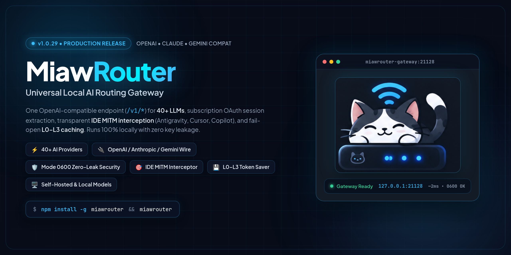

<p align="center">
  
</p>

<p align="center">
  <a href="https://www.npmjs.com/package/miawrouter"></a>
  <a href="https://nodejs.org"></a>
  <a href="LICENSE"></a>
  <a href="SECURITY.md"></a>
  <a href="#mitm-interception"></a>
</p>

<p align="center">
  <a href="README.md">English</a> ·
  <a href="i18n/README.id-ID.md">Bahasa Indonesia</a>
</p>

MiawRouter is a local AI gateway. It runs on your machine, serves one OpenAI-compatible endpoint at `/v1`, and routes each request to a provider driver in `open-sse/providers/registry/`. It rewrites request and response formats between providers, fails over to the next account or model in a combo when one breaks, and serves a dashboard on the same port.

Nothing leaves your machine except the requests you route to an upstream provider.

## Contents

- [What it does](#what-it-does)
- [Quick start](#quick-start)
- [First run](#first-run)
- [Dashboard map](#dashboard-map)
- [Connect your CLI or IDE](#connect-your-cli-or-ide)
- [Providers and routing](#providers-and-routing)
- [MITM interception](#mitm-interception)
- [Token saver cache](#token-saver-cache)
- [Security model](#security-model)
- [Configuration](#configuration)
- [Development](#development)
- [Documentation](#documentation)

## What it does

| Capability | How it works |
| --- | --- |
| One endpoint for every tool | `/v1/chat/completions`, `/v1/messages`, `/v1/models`, and the rest of the OpenAI surface. Point any OpenAI-compatible client at it. |
| Provider drivers | 146 definitions under `open-sse/providers/registry/`, covering cloud APIs, subscription OAuth, free tiers, local runtimes, and media providers. |
| Format translation | Translates between OpenAI, Anthropic, Gemini, and provider-specific wire formats, including streaming SSE and Protobuf relays. |
| Fallback combos | Ordered model chains with automatic failover, plus round-robin pools for multi-account setups. |
| MITM interception | Reroutes traffic from Antigravity, Cursor, GitHub Copilot, and Amazon Q without editing their config files. |
| Token saver cache | Four fail-open cache layers in `open-sse/cache/` that reduce outbound tokens. |
| Local runtimes | Whisper, llama.cpp, vLLM, Kokoro-FastAPI, and any OpenAI-compatible speech, embedding, or chat server you host. |

## Quick start

### Install globally

```bash
npm install -g miawrouter
miawrouter
```

The CLI starts the server and opens the dashboard at `http://127.0.0.1:21128/dashboard`. Data is stored in `~/.miawrouter`.

### Run from source

```bash
git clone https://github.com/skutanjir/miawrouter.git
cd miawrouter
cp .env.example .env
npm install
npm run dev
```

The dev server listens on `http://127.0.0.1:21127`. To run the production build:

```bash
npm run build
npm run start
```

`npm run start` listens on `http://127.0.0.1:21128`. The two scripts pin their ports, so `PORT` in `.env` does not move a dev server that was started with `npm run dev`.

### Docker

```bash
docker build -t miawrouter .
docker run -d --name miawrouter \
  -p 21128:21128 \
  -v "$HOME/.miawrouter:/app/data" \
  -e DATA_DIR=/app/data \
  miawrouter
```

Or bring up the bundled compose file, which also starts a Headroom sidecar:

```bash
docker compose up -d
```

## First run

1. Open `http://127.0.0.1:21128` from the same machine. There is no default password, so the first visit over loopback asks you to create one with at least 8 characters.
2. Open **Endpoint**. If no API key exists yet, the page creates one named `Default Key`, so `/v1` works without manual setup. Copy it from the API Keys panel.
3. Open **Providers** and connect what you want to route to. API keys, OAuth subscriptions, and free tiers are all added from here.
4. Point your client at `http://127.0.0.1:21128/v1` with that key.

Dashboard setup routes accept loopback connections only. A remote visitor gets HTTP 403.

## Dashboard map

The dashboard carries about 40 pages. The ones you will open most:

| Page | Purpose |
| --- | --- |
| **Providers** | Connect providers, test them in bulk, manage multiple accounts per provider. |
| **Endpoint** | API endpoint configuration, API key management, tunnel and Tailscale exposure. |
| **Combos** | Model combos with fallback and round-robin strategies, plus the vision and audio capacity adapter. |
| **CLI Tools** | Per-tool configuration for the CLIs and IDEs listed below. |
| **Usage** | The provider topology graph and live route tracing. |
| **Logs** / **Activity** | Request history, per-request token counts, and errors. |
| **Costs** / **Quota** | Spend tracking and provider quota burn. |
| **Token Saver** / **Cache** | Cache hit rates, cache layers, and savings. |
| **MITM** | Certificate authority management and intercepted traffic. |
| **Settings** | Runtime configuration, proxy pools, webhooks, and cloud sync. |

## Connect your CLI or IDE

| Client | Base URL | Key | Notes |
| --- | --- | --- | --- |
| Claude Code | `http://127.0.0.1:21128/v1` | MiawRouter key | Anthropic-format routing |
| Codex CLI | `http://127.0.0.1:21128/v1` | MiawRouter key | Codex reasoning overrides |
| Cursor | `http://127.0.0.1:21128/v1` | MiawRouter key | Or use MITM instead of a base URL |
| Cline / Roo Code | `http://127.0.0.1:21128/v1` | MiawRouter key | OpenAI-compatible |
| OpenCode / Hermes | `http://127.0.0.1:21128/v1` | MiawRouter key | Any registered model or combo |
| Antigravity / Copilot / Amazon Q | not configurable | not applicable | Handled by MITM |

The **CLI Tools** page writes the config for each of these for you.

## Providers and routing

`open-sse/providers/registry/` holds one file per provider, and `open-sse/providers/registry/index.js` imports all of them. Categories:

- **Cloud APIs**: OpenAI, Anthropic, Google Gemini, DeepSeek, xAI, Groq, Mistral, Cohere, Together, Cerebras, SiliconFlow, OpenRouter, and others.
- **Subscription OAuth**: active Claude Code, Codex, GitHub Copilot, and Cursor subscriptions. Tokens refresh in the background.
- **Free tiers**: the free model catalog, including Vertex and OpenCode free entries.
- **Media and local**: speech to text, text to speech, embeddings, and self-hosted chat servers.

### Combos

A combo is an ordered list of models. MiawRouter tries each entry until one answers. Round-robin combos spread load across the accounts in a pool. The **Combos** page also holds the capacity adapter: when the selected model cannot read images or audio, the adapter routes that one request to a pool model that can.

### Model naming

Address a model as `provider/model` (for example `anthropic/claude-sonnet-4`), or address a combo by its ID. `/v1/models` lists everything currently routable.

## MITM interception

`src/mitm/` runs a local TLS interception proxy so desktop tools that hardcode their backend host can still be rerouted. The proxy generates a local root CA on first boot, decrypts the connection, normalizes gRPC, Protobuf, SSE, or JSON, applies your routing, and forwards to the provider you chose.

```
[ Antigravity / Cursor / Copilot / Amazon Q ]
                    │
                    ▼  host redirected to 127.0.0.1
          [ MiawRouter MITM :443 ]
                    │
        ├── decrypt with the local root CA
        ├── normalize the wire format
        ├── apply aliases and combos
        └── forward to the selected provider
```

Intercepted hosts live in `src/mitm/config.js`:

| Target | Hosts |
| --- | --- |
| Google Antigravity | `cloudcode-pa.googleapis.com`, `daily-cloudcode-pa.googleapis.com` |
| Cursor | `api2.cursor.sh`, `agent.api5.cursor.sh`, `agentn.api5.cursor.sh` and their regional variants |
| GitHub Copilot | `api.individual.githubcopilot.com` |
| Amazon Q / Kiro | `q.us-east-1.amazonaws.com`, `codewhisperer.us-east-1.amazonaws.com`, `runtime.us-east-1.kiro.dev` |

### Wire capture

Capture is off by default. Turn it on only while debugging:

```bash
export MITM_CURSOR_CAPTURE=1        # metadata only: method, path, byte counts, header names
export MITM_CURSOR_CAPTURE_FULL=1   # add raw bytes, written to $DATA_DIR/logs/mitm/ at mode 0600
```

Metadata capture never writes headers, cookies, tokens, or body text. Raw capture can contain prompts and tool results, so point it at a sanitized prompt and delete the captures when you are done.

## Token saver cache

Four layers in `open-sse/cache/`, all fail-open. A cache failure falls through to the provider instead of failing the request.

| Layer | What it does |
| --- | --- |
| L0 | Keeps request prefixes stable so provider-side prompt caching keeps hitting. |
| L1 | Exact-match LRU for deterministic, tool-free completions. |
| L2 | Embedding similarity for paraphrased prompts. |
| L3 | Deduplicates repeated conversation blocks and context payloads. |

Every response reports which layer answered through the `X-Miaw-Cache` and `X-Miaw-Cache-Layer` headers. Skip the cache for one request with `X-Miaw-Token-Saver: off`.

## Security model

1. **Loopback by default.** The server binds `127.0.0.1`. Remote requests to dashboard setup routes return 403.
2. **Generated secrets.** `JWT_SECRET`, `API_KEY_SECRET`, and `MACHINE_ID_SALT` are created on first boot as 32 random bytes and stored at mode `0600` under `$DATA_DIR`.
3. **Weak secret rejection.** `secret-policy.cjs` refuses placeholder secrets such as documented examples before the listener binds.
4. **Socket-derived client IP.** `custom-server.js` reads the client address from the TCP socket and strips `X-Forwarded-For` unless a trusted loopback proxy set it.
5. **SSRF guard.** `src/shared/utils/ssrfGuard.js` blocks outbound requests to cloud metadata addresses, private ranges, and loopback.
6. **Packaging isolation.** The CLI builds inside an isolated temporary directory with exclusion filters, so local databases and credentials cannot reach a published artifact.

[SECURITY.md](SECURITY.md) has the threat model and the disclosure process.

## Configuration

`.env.example` is the contract; every name below is read by the running code.

| Variable | Default | Meaning |
| --- | --- | --- |
| `DATA_DIR` | `~/.miawrouter` | Where the database, secrets, and logs live. |
| `PORT` | `21128` | Listen port for the packaged server. `npm run dev` pins 21127 and `npm run start` pins 21128. |
| `INITIAL_PASSWORD` | unset | Optional first password. The first successful loopback login bcrypt-hashes it into the database. |
| `JWT_SECRET` | generated | Signing key for the dashboard session cookie. |
| `API_KEY_SECRET` | generated | HMAC secret for generated API keys. |
| `MACHINE_ID_SALT` | generated | Salt for stable machine ID hashing. |
| `REQUIRE_API_KEY` | `true` | Gate `/v1` and `/v1beta` behind a valid key. `true` and `false` override the dashboard setting; unset follows it. |
| `BASE_URL` | `http://localhost:21128` | Address this instance uses when it calls its own cloud sync routes. |
| `CLOUD_URL` | `https://miawrouter.web.id` | Cloud sync host. |
| `ENABLE_REQUEST_LOGS` | `false` | Write request logs. |
| `OBSERVABILITY_ENABLED` | `true` | Expose metrics and health signals. |
| `AUTH_COOKIE_SECURE` | `false` | Set the `Secure` flag on the auth cookie when serving over HTTPS. |
| `HTTP_PROXY` / `HTTPS_PROXY` / `ALL_PROXY` / `NO_PROXY` | unset | Outbound proxy for provider calls. Lowercase variants work too. |
| `SEARXNG_URL` | unset | Endpoint for the built-in web search provider. |
| `MITM_CURSOR_CAPTURE` / `MITM_CURSOR_CAPTURE_FULL` | `0` | Wire capture for the Cursor relay. See [MITM interception](#mitm-interception). |

## Development

```bash
npm install
npm run dev        # http://127.0.0.1:21127
```

| Script | Runs |
| --- | --- |
| `npm run dev` | Next.js dev server on port 21127 |
| `npm run dev:webpack` | Same, forced onto webpack |
| `npm run build` | Production build |
| `npm run start` | Production server on port 21128 |
| `npm run lint` | ESLint over the repository |
| `npm test` | Full suite through `scripts/run-tests.mjs` |
| `npm run test:ci` | CI suite, no provider credentials required |
| `npm run ci` | lint plus `test:ci` |
| `npm run bench` | Benchmark harness in `bench/` |
| `npm run bench:record` / `npm run bench:verify` | Record or verify a benchmark baseline |
| `npm run cli:pack` / `npm run cli:publish` | Package or publish the CLI in `cli/` |

Tests live in `tests/`, split into `unit/`, `translator/`, and a characterization baseline in `__baseline__/`. The CI suite runs without real provider credentials, so you can reproduce a green pipeline locally with `npm run ci`.

The branding gate is part of the repository contract:

```bash
node scripts/check-branding.mjs
```

It walks the tree and fails on any leftover reference to the project this codebase was forked from. Run it before opening a pull request.

## Documentation

- [SECURITY.md](SECURITY.md): threat model and vulnerability disclosure.
- [DOCKER.md](DOCKER.md): container deployment detail.
- [CONTRIBUTING.md](CONTRIBUTING.md): development workflow and how to add a provider.
- [CHANGELOG.md](CHANGELOG.md): release notes.

## Contributing

Bug reports, provider integrations, and documentation fixes are welcome. Read [CONTRIBUTING.md](CONTRIBUTING.md) first, then run `npm run ci` and `node scripts/check-branding.mjs` before you open a pull request.

## License

[MIT](LICENSE).
